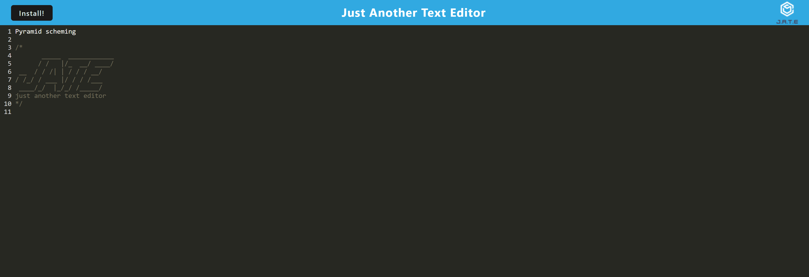
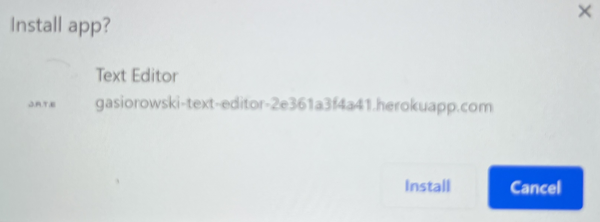
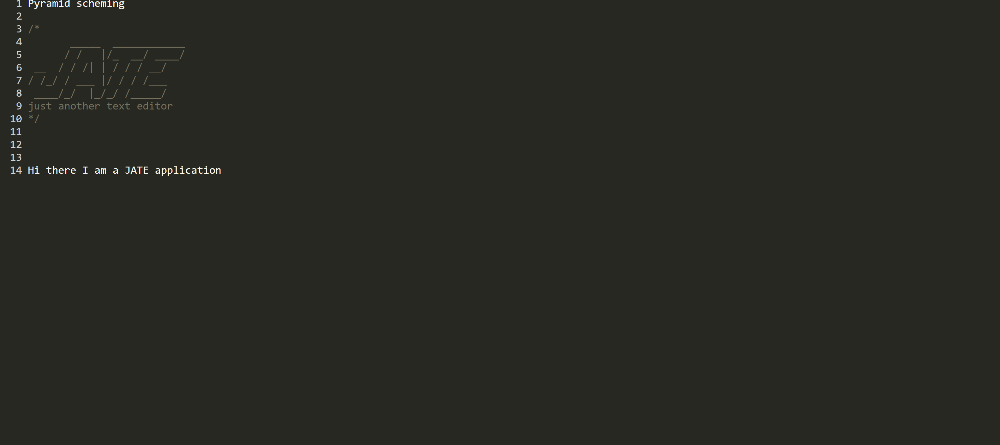

# Text-Editor

## Description:
This project is a text editor application, the code was generated by myself with the assistance of the GWU coding Boot camp tutoring program. Using this will allow a user to type in notes which will be saved in local storage so they can be viewed even after closing or refreshing the tab. Additionallythe user will have the ability to download the application via an install button at the top of the application.

## Installation:
This application requires no additional softeware or programs to be installed. Access to a stable internet connection and the link to the website are all that are required to use this application.

## Usage: 
### The user will open the site and be greeted with this homescreen

### If the user clicks in the top left corner on the "install" button they will have the ability to install the application to their system.

### The user has the ability to type notes which will be saved in local storage and can be seen evem after refreshing or closing the text editor.

MIT License

#### A working link for this application is
https://gasiorowski-text-editor-2e361a3f4a41.herokuapp.com/
